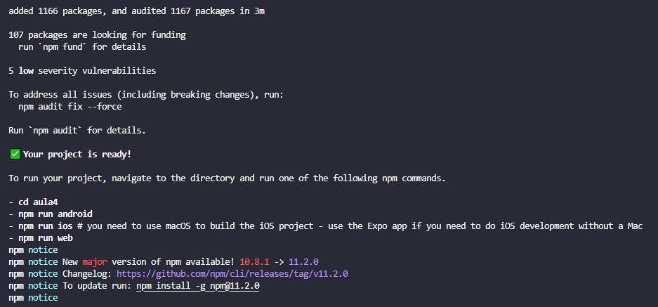

# Desenvolvimento Mobile
## Primeiro veja se o npm esta instalado

##### Execute no terminal do VsCode
- npm --version

Ele retornará a versão que está instalado.

---

##### Caso não esteja instalado ou queira atualizar
- npm install npx@latest -g

---

##### Logo em seguida execute

- npm create-expo-app

ou

- npx create-expo-app@latest

---

##### Em seguida aparecerá

- *my-app*

##### Se quiser renomear apenas digite o nome que deseja, senão confirme com ENTER

###### *vale lembrar que se apenas confirmou o nome da pasta será my-app, automaticamente*

---

##### Talvez apareça algo relacionado com "(y/n)"

- digite Y que referesse a YES ou seja SIM, e aperte ENTER

---

Logo após finalizar a instalação, ele lhe dara os comandos 

---

Ou pode seguir os comandos abaixo

*para entrar na pasta*

- cd *{nome da sua pasta}* -- ENTER

depois

- npm run android --ENTER

##### Ele fará o "start" do app.mobile

---

##### Verifique se a data esta atualizada e as horas
- entre em Expo.dev {detalhe lembre de estar com o "start do mobile feito" do npm run android}
- e ele mostrara um "Bem-Vindo" do expo

---

##### Em seguida volte no VsCode

e execute 
- Ctrl + c 

para parar o "start" servidor do app mobile

---

##### Logo após abra a pasta e procure por

- packge.json 

dentro do arquivo tera algo relacionado com 

- "reset-project": "node ./scripts/reset-project.js"

copie 

- reset-project

e cole no terminal o seguinte comando

- *npm run reset-project* e confirme

##### Pronto agora é só entrar na pasta APP e procurar o arquivo *index.tsx* e começar a editar seu arquivo app mobile